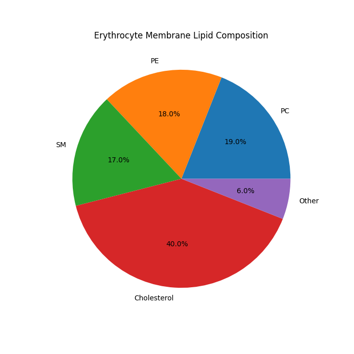
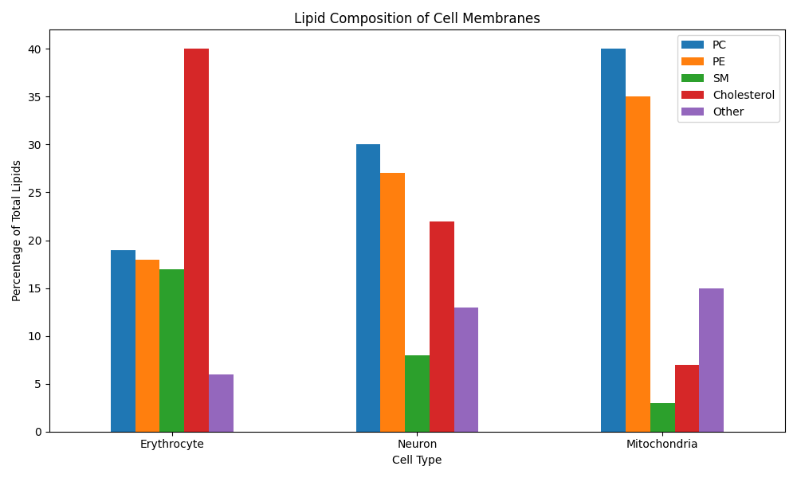

# Cell Membrane Lipid Composition Analysis

## Description
This project analyzes and visualizes the lipid composition of cell membranes
in three cell types: erythrocytes, neurons, and mitochondria.

## Data
Lipid percentages (mol%) based on van Meer et al., 2008 and Sastry, 1985.

| Lipid | Erythrocyte | Neuron | Mitochondria |
|-------|-------------|--------|--------------|
| PC    | 19%         | 30%    | 40%          |
| PE    | 18%         | 27%    | 35%          |
| SM    | 17%         | 8%     | 3%           |
| Cholesterol | 40%   | 22%    | 7%           |
| Other | 6%          | 13%    | 15%          |

## Results



## Discussion

### What we investigated
We compared the lipid composition of membranes in three cell types:
erythrocytes, neurons, and mitochondria and analyzed how composition 
relates to cell function.

### Finding 1 — each cell tunes its membrane for its specific function
All three rows in our dataset differ significantly from each other, 
despite all being cell membranes from the same organism.

### Finding 2 — erythrocytes build membranes that are both strong and flexible
Erythrocytes have the highest cholesterol (40%) and high sphingomyelin (17%). 
Cholesterol makes the membrane resilient — neither too rigid nor too fluid. 
This explains why erythrocytes do not rupture when squeezing through 
capillaries narrower than the cell itself.

### Finding 3 — neurons build flexible membranes for long projections
Neurons have the highest PE (27%) and relatively low cholesterol (22%). 
PE promotes membrane curvature and flexibility. This is consistent with 
the fact that axons can reach up to one meter in length, requiring 
a membrane that easily adapts to any shape.

### Finding 4 — mitochondria maximize surface area for energy production
Mitochondria have the highest PC (40%) and PE (35%), but minimal cholesterol 
(7%) and sphingomyelin (3%). Cholesterol and SM increase membrane rigidity, 
which mitochondria do not require — instead, they prioritize maximum inner 
membrane surface area for ATP synthesis.

### Finding 5 — inverse relationship between SM and PE
The most striking pattern visible directly on the comparison chart:

| Cell Type    | SM  | PE  |
|--------------|-----|-----|
| Erythrocyte  | 17% | 18% |
| Neuron       | 8%  | 27% |
| Mitochondria | 3%  | 35% |

As SM increases, PE decreases and vice versa. SM contributes to membrane 
rigidity while PE contributes to flexibility. Each cell appears to balance 
these two properties according to its functional requirements.

## Conclusion
This analysis demonstrates that lipid composition is not random 
it is precisely regulated to match the mechanical and functional 
demands of each cell type.

## Requirements
- Python 3
- pandas
- matplotlib

## Usage
```bash
python membrane_analysis.py
```
